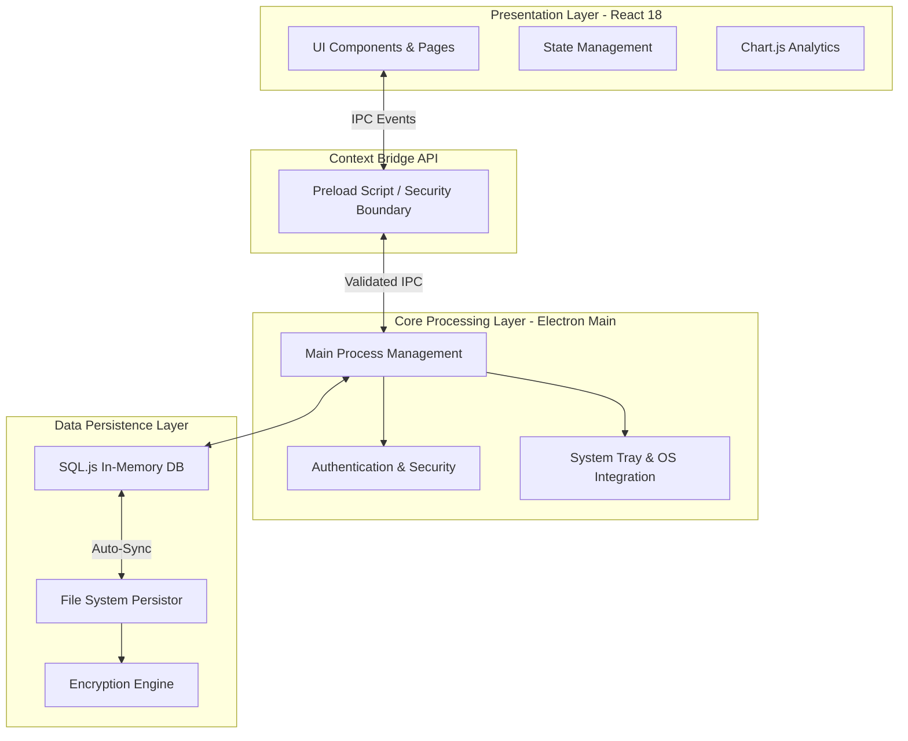

# Enterprise POS & ERP Business Management System

<div align="center">
  
  
  
  
</div>

---

## 1. Executive Summary

The **Enterprise POS & ERP Business Management System** is a comprehensive, production-grade desktop application engineered to streamline complex business operations. Designed for high availability and maximum efficiency, the system offers an offline-first architecture suitable for supermarkets, restaurant chains, pharmacies, and large-scale retail franchises. It integrates Point of Sale (POS) functionality with backend Enterprise Resource Planning (ERP), Customer Relationship Management (CRM), and Human Resources (HR) workflows.

---

## 2. System Architecture

The application is built on a robust, offline-first desktop architecture that ensures uninterrupted business operations regardless of network connectivity.



---

## 3. Core Capabilities

### 3.1 Point of Sale (POS) Module
- **High-Throughput Billing**: Touchscreen-optimized interface designed for rapid checkout.
- **Advanced Payment Gateway**: Native support for Split Payments (Cash, Card, Digital Wallet).
- **Cart Workflows**: Ability to hold, recall, and manage multiple customer tabs simultaneously.
- **Hardware Integration**: Automated receipt printing and barcode scanner compatibility.

### 3.2 Enterprise Resource Planning (ERP)
- **Multi-Branch & Warehouse**: Centralized orchestration of stock transfers, branch metrics, and GRN workflows.
- **Real-Time Inventory**: Batch tracking, automated low-stock warnings, and dynamic valuation reporting.
- **Accounting & Ledger**: Automated chart of accounts, income/expense tracking, and balance sheet compilation.

### 3.3 Human Capital & Customer Relations
- **Customer Tiers & Loyalty**: Integrated membership levels (Standard/Silver/Gold) and wallet point systems.
- **Employee Management**: Attendance tracking, salary disbursement, role-based shift assignments, and leave management.

---

## 4. Technical Specifications

### 4.1 Technology Stack

| Layer | Technology | Specification |
|-------|------------|---------------|
| **Core Framework** | Electron | v28.2.2 (Cross-Platform Desktop Runtime) |
| **Presentation** | React.js / Vite | v18.2.0 / v5.1.2 (Hardware-Accelerated UI) |
| **Styling Engine** | TailwindCSS / Framer | Utility-first CSS with 60fps micro-animations |
| **Database Engine** | SQL.js | v1.8.0 (Embedded SQLite with WASM execution) |
| **Security Layer** | bcryptjs | v2.4.3 (10-round salted password hashing) |

### 4.2 System Requirements

* **OS Support**: Windows 10/11 (64-bit) • macOS 10.13+ (64-bit) • Major Linux distributions (Ubuntu 20.04+, Debian, Fedora)
* **Processor**: Intel Core i3 (7th gen) / AMD Ryzen 3 (2000 series) or newer – supports multi‑core scaling
* **Memory**: Minimum 4 GB RAM (8 GB recommended for heavy reporting)
* **Storage**: Minimum 1 GB SSD (additional space for data archives)
* **Enterprise‑Scale**: Designed for multi‑site deployments, clustering, and high‑availability configurations

---

## 5. Deployment & Installation Guide

### 5.1 Environment Prerequisites
- **Node.js**: v18.x or v20.x LTS (*Critical: Node.js v24+ is unsupported and will fail native bindings compilation*).
- **Git**: Configured for your corporate network.

### 5.2 Local Development Setup

```bash
# 1. Clone the repository to your local development environment
git clone https://github.com/ShahabAhmed01/enterprise-pos-erp.git
cd enterprise-pos-erp

# 2. Install validated dependencies
npm install

# 3. Launch the application in development mode
npm run dev:main
```

### 5.3 Default Administrator Credentials

Upon first launch, the system automatically seeds the secure database. You may log in using the following test credentials:

| Access Level | Corporate Email | Default Password |
|--------------|-----------------|------------------|
| **Super Administrator** | `admin@enterprise-pos.com` | `admin123` |
| **Branch Manager** | `manager@enterprise-pos.com` | `admin123` |
| **POS Cashier** | `cashier@enterprise-pos.com` | `admin123` |

*(Note: In production environments, ensure these default credentials are rotated immediately).*

---

## 6. Operations & Troubleshooting

The following are documented resolutions for common environmental issues encountered during enterprise deployment:

### 6.1 Application Starts with Multiple Blank Windows
* **Root Cause**: Zombie `electron.exe` or `node.exe` processes from an interrupted debug session are holding port TCP/5173.
* **Resolution**: Terminate all lingering instances via Task Manager (`taskkill /F /IM electron.exe` and `taskkill /F /IM node.exe`) and restart cleanly.

### 6.2 Native Compilation Errors (`node-gyp`)
* **Root Cause**: Host environment is running an incompatible, non-LTS version of Node.js (e.g., v24) causing Electron native module rebuilds to fail.
* **Resolution**: Downgrade the host Node.js environment strictly to an LTS channel (v20.x or v18.x).

### 6.3 Database Fault: `Statement closed`
* **Root Cause**: Reusing a freed SQL prepared statement reference during batched database seeding.
* **Resolution**: Ensure all loop-based database inserts invoke `db.prepare()` independently to generate a fresh statement reference (Patched in `v1.0.0`).

### 6.4 Bundler Fault: `Cannot set properties of undefined (setting 'exports')`
* **Root Cause**: Aggressive ESM bundling by Vite strips the `module.exports` object from the CommonJS-based `sql.js` driver.
* **Resolution**: Retain `sql.js` within the `rollupOptions.external` array in `vite.config.js` to defer resolution to Node's native CommonJS loader (Patched in `v1.0.0`).

---

## 7. Security & Compliance

The system is designed with enterprise-grade security considerations:
- **Zero-Trust IPC**: The renderer process runs in an isolated context with Node integration disabled. All interactions traverse a strictly validated Context Bridge.
- **Data Protection**: All authentication vectors utilize salted `bcrypt` hashing.
- **RBAC Matrix**: Access to modules is governed by a strict Role-Based Access Control matrix encompassing 8 standard corporate roles.

---

## 8. License & Copyright

**Open Source (MIT License)**

This project is released under the MIT License. See the `LICENSE` file in this repository for the full text.

Contributions are welcome — please review the contribution guidelines and open issues or pull requests on GitHub.